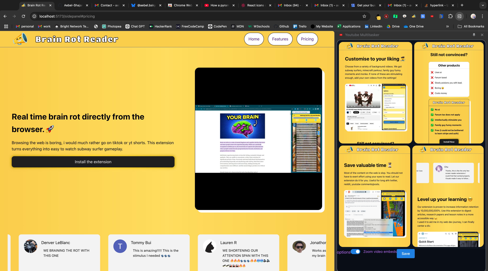

# Brain rot reader website

I made this website for my chrome extension : brain rot reader.

Landing page with product preview, review carousel & pricing section.

Preview:



## Setup Instructions
To set up and run this React Vite TypeScript application, follow these steps:

0. **Prerequisites**
Before you begin, ensure you have met the following requirements:
- You have installed [Node.js](https://nodejs.org/) (which includes npm).
- You have access to a terminal

1. **Clone the repository:**
  ```bash
  git clone https://github.com/your-username/brain-rot-reader-website.git
  cd brain-rot-reader-website
  ```

2. **Install dependencies:**
  ```bash
  npm install
  ```

3. **Run the development server:**
  ```bash
  npm run dev
  ```

4. **Build the project:**
  ```bash
  npm run build
  ```
